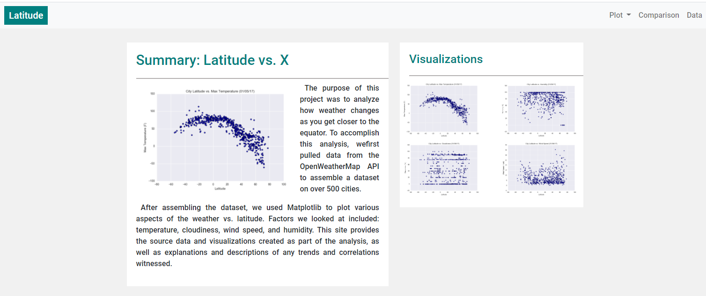

# Web Design Homework - Web Visualization Dashboard (Latitude)

## Background
Data is more powerful when we share it with others! Let's take what we've learned about HTML and CSS to create a dashboard showing off the analysis we've done.

## Latitude - Latitude Analysis Dashboard with Attitude

We'll be creating a visualization dashboard website using visualizations we've created in a past assignment. Specifically, we'll be plotting [weather data](Resources/cities.csv).

In building this dashboard, we'll create individual pages for each plot and a means by which we can navigate between them. These pages will contain the visualizations and their corresponding explanations. We'll also have a landing page, a page where we can see a comparison of all of the plots, and another page where we can view the data used to build them.